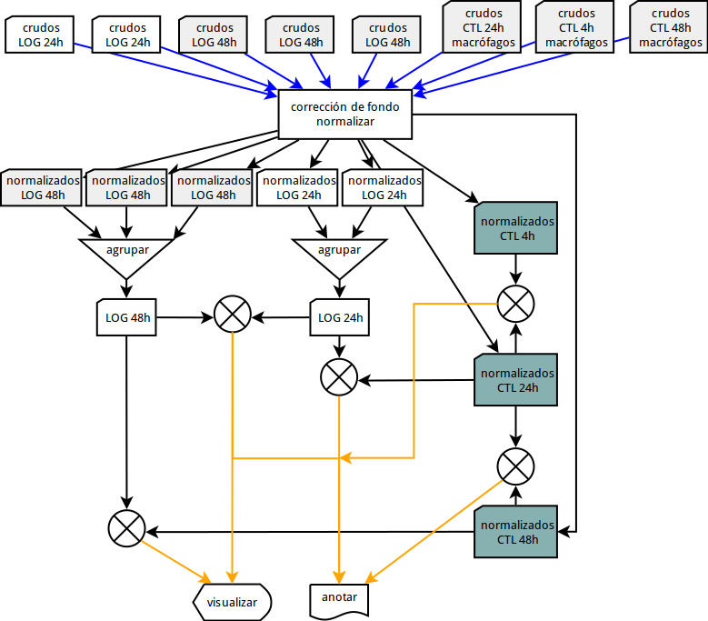
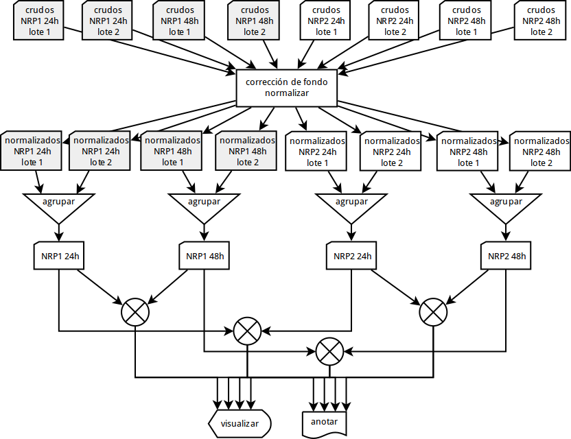

# Tuberculosis-NRP

Este repositorio contiene scripts para analizar expresión génica de
tuberculosis y macrófagos en diferentes lapsos y fases, medida por un
instrumento Agilent.

# Datos

1. Log Glu y Ctrls 2 lavado. Contienen dos réplicas biológicas
   etiquetadas L1 y L2. Los controles están formados por una mezcla de
   RNAs de diferentes experimentos.

   1.1. CTLR 4h: este es el experimento de células sin infectar, sólo
		tiene RNA de macrófagos. 4 horas es el primer tiempo en todos
		los experimentos.

   1.2. CTRL 24h y CTRL 48h: son los experimentos de los siguientes
		tiempos, unicamente RNA de macrófagos

   1.3. Condiciones de infección LOG (de fase logarítmica de
		crecimiento) en experimentos de 24 y 48h con dos y tres
		replicas biológicas, respectivamente. En estos experimentos
		hay RNA tanto del macrófago como de M. tuberculosis.  No
		tenemos la fase de 4h en los areglos porque ese RNA bacteriano
		no estaba listo. De este arreglo solo hay que analizar la
		expresión de los experimentos de 24h y de 48h

2. Carpeta txt NRP1 y NRP2. Las NRP son las fases de latencia in vitro
de tb. La fase 1 es de hipoxia (baja tensión de O2) y la fase 2 es de
anoxia (sin O2). Para cada fase de latencia tenemos dos archivos del
experimento de 24 h y dos del de 48 porque son dos replicas
biológicas.

# Análisis

## Microarreglo LOG y CTRL

De las fases LOG, contrastes:
 - entre 24h y 48h.
 - entre controles 4h, 24h y 48h

## Microarreglo NRP

Contrastes:

- 24h contr 48h en 1 y w

- NRP2 24H contra NRP1 24h y NRP2 48h contra NRP1 48h.

## Contraste inter-microarreglo

- NRP1 24h contra LOG 24h
- NRP1 48h contra LOG 48h
- NRP2 24h contra LOG 24h
- NRP2 48h contra LOG 48h

Estos contrastes precisan de la creación de un baseline para
normalizar entre los dos arreglos.

# Código fuente

El código en R del análisis usa la biblioteca [Limma](http://bioconductor.org/packages/2.5/bioc/html/limma.html).

 - [nrp_limma.R](nrp_limma.R)
 - [log_limma.R](log_limma.R)

Usamos la biblioteca
[Agilp](https://www.bioconductor.org/packages/release/bioc/vignettes/agilp/inst/doc/agilp_manual.pdf)
en el pipeline de Python.

# Referencias

http://matticklab.com/index.php?title=Single_channel_analysis_of_Agilent_microarray_data_with_Limma
